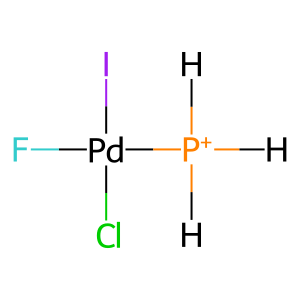
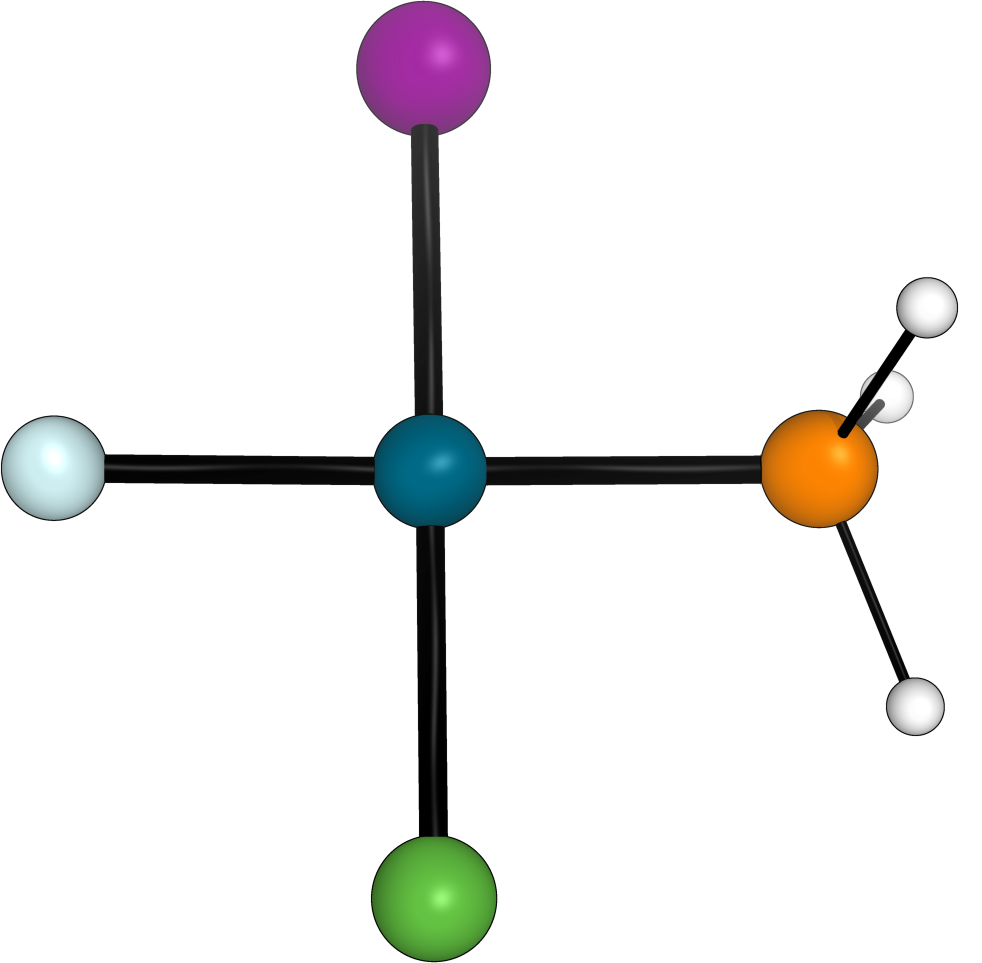

Metal complex from SMILES input
===============================

In the following example we will generate various conformers of a 
Pd complex using RDKit using a template for square planar complexes.

+-----------------------------------------------+
| .. centered:: **SMILES**                      |
+-----------------------------------------------+
| .. centered:: I[Pd]([PH3+])(F)Cl              |
+--------------------------+--------------------+
|  |metal_comp_chemdraw|   |  |metal_comp_3D|   |
+--------------------------+--------------------+

Here we have to specify the metalic centers :code:`--metal_atoms "['Pd']"` as well as 
their oxidation state :code:`--metal_oxi "[2]"`. 

We can also specify the multiplicity :code:`--mult 1`

We also need to specify which template geometry to use for the complex 
:code:`--complex_type squareplanar`

We specify the output directory where the sdf with conformations will be 
generated :code:`--destination Pd_sdf_files` and the base name of the file
:code:`--name Pd_complex`

We provide the smiles string of the molecule :code:`--smi "I[Pd]([PH3+])(F)Cl"`

And we need to specify that we will be using the CSEARCH module with rdkit to 
generate the conformers :code:`--csearch --program rdkit`

The full command that we will execute will look as follows:

.. code:: shell

   python -m aqme --csearch --smi "I[Pd]([PH3+])(F)Cl" --destination Pd_sdf_files --name Pd_complex --program rdkit --metal_atoms "['Pd']" --metal_oxi "[2]" --mult 1 --complex_type squareplanar

