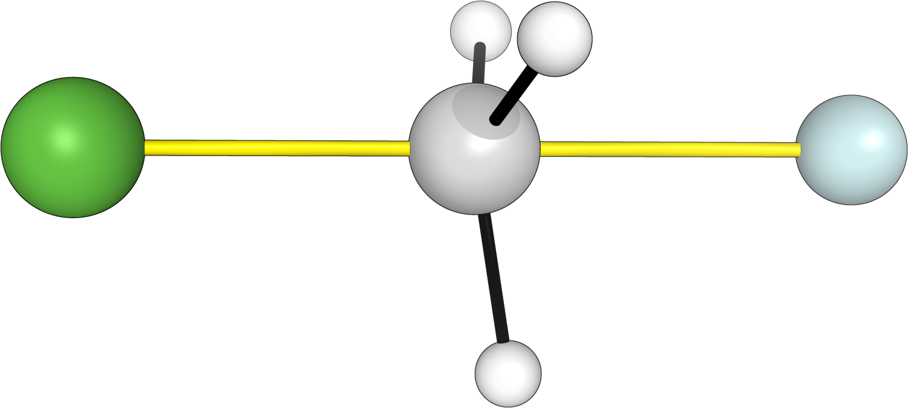
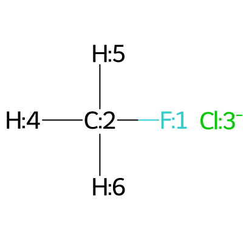

.. |nocov_ts_chemdraw| image:: ../../images/nocov_ts_chem.png
   :width: 400

TS involving generated from SMILES
==================================

In the following example we will generate conformers of the SN2 transition state 
involving a cloride ion and fluoromethane in water. 

+-----------------------------------------------+
| .. centered:: **SMILES**                      |
+-----------------------------------------------+
| .. centered:: O.FC.[Cl-]                      |
+--------------------------+--------------------+
|  |nocov_ts_chemdraw|     |  |nocov_ts_3D|     |
+--------------------------+--------------------+

In the following example we need a mapped SMILES to set up the constraints. We 
can either use rdkit for it in python, in a jupyter notebook (see 
:doc:`python example <../../examples_python/conformer_search/noncovalent_TS>` )
or we can write the SMILES by ourselves (not recommended). 

The mapped smiles that we will be using is the following one: 

|mapping|

:: 

   [Cl-:3].[F:1][C:2]([H:4])([H:5])[H:6]

Now that we have the mapping, we can easily proceed to set up the constraints.
In this case we want the C-F and the Cl-C bond distances to be constrained and 
equal to 1.8 angstroms and we want the angle Cl-C-F to be of 180º. 

As a consequence the distance constraints will be :code:`"[[1,2,1.8],[2,3,1.8]]"`
and the angle constrains :code:`"[[1,2,3,180]]"`

Finally we proceed to the conformer generation using CREST

.. code:: shell

   python -m aqme --csearch --name "TS-example" --nprocs 12 --program crest --cregen --crest_keywords "--alpb h2o" --xtb_keywords "--alpb h2o" --constraints_dist "[[1,2,1.8],[2,3,1.8]]" --constraints_angle "[[1,2,3,180]]" --smi "[Cl-:3].[F:1][C:2]([H:4])([H:5])[H:6]"

