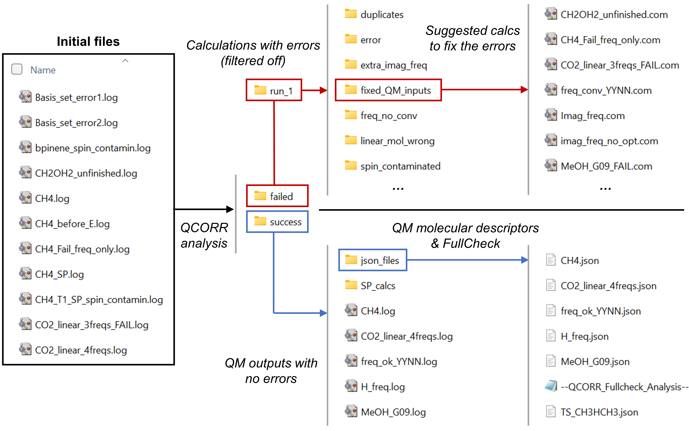

=======================
Correction of QM Output
=======================

.. warning:: 

    The command line usage of QCORR is slightly unstable. It is recommended 
    to use the python interface of QCORR instead until we have finished 
    working on it. 

The QCORR module focuses on the analysis and correction of the output files of 
QM calculations. Here we refer to correction as: 

*  Generate new inputs from calculations that have an error termination. 
*  Generate new inputs for minima containing a small imaginary frequency
*  Ensure that all provided files have the same level of theory, grid size, 
   program, version, etc.

The following scheme shows how QCORR works and how it sorts the calculations.

|QCORR_scheme|

Analyzing the output files
--------------------------

For these tasks we will be using the qcorr module :code:`--qcorr`

Then we list the files that we want to analyze. In this case we are going to 
analyze Gaussian16 output files. We are going to assume that we have our 
files in the folder 'calculations' therefore :code:`--files "calculations/*.log"`

.. warning:: 

   Please notice that shell wildcard arguments need to be provided as strings.
   :code:`--files "calculations/*.sdf"` should be provided instead of 
   :code:`--files calculations/*.sdf`. This feature might change in future to 
   follow the usual conventions. 

We can need to indicate the extension of the initial input files 
:code:`--isom_type com` as well as the folder where those files are 
:code:`--isom_inputs folder`

We can specify the :code:`--freq_conv "opt=(calcfc,maxstep=5)"` which will 
attempt to fix calculations whose optimization ended normally but whose 
frequency calculation did not. 

Finally we run the analysis of the files.

.. code:: shell 

   python -m aqme --qcorr --files "calculations/*.log" --isom_type com --isom_inputs folder 

If we instead wanted to skip the checks and generate the .json files containing 
information about our calculations we can use the :code:`--fullcheck False` keyword.

.. code:: shell 

   python -m aqme --qcorr --fullcheck False --files "calculations/*.log"
