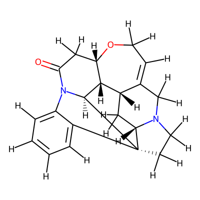

Strychnine
==========

Along the steps of this example workflow we will show how to: 

i)   Generate different conformers of the molecule using CSEARCH
ii)  Generate the inputs for the QM geometry optimization
iii) Fix error terminations and imaginary frequencies of the output files
iv)  Calculation and analyze the NMR chemical shifts for the conformers
     generated.
v)   Use GoodVibes to calculate the Boltzmann distributions using Gibbs free
     energies at 298.15 K

Specifically, in this example we will calculate the NMR chemical shifts of the strychnine
starting from the smiles representation of said molecule that we can see below. 

+---------------------------------------------------------------------------------------+
|                         .. centered:: **SMILES**                                      |
+---------------------------------------------------------------------------------------+
| .. centered:: C1CN2CC3=CCO[C@H]4CC(=O)N5[C@H]6[C@H]4[C@H]3C[C@H]2[C@@]61C7=CC=CC=C75  |
+---------------------------------------------------------------------------------------+
|                      .. centered::  |Strychnine|                                      |
+---------------------------------------------------------------------------------------+

.. note::

   A jupyter notebook containing all the steps shown in this example can be found 
   in the AQME repository in `Github  <https://github.com/jvalegre/aqme>`__ or in 
   `Figshare <https://figshare.com/articles/dataset/AQME_paper_examples/20043665>`__

.. note:: 

   A video tutorial illustrating this example can be found 
   in our `youtube channel <https://www.youtube.com/watch?v=d4mQoE8gPJw>`__

.. contents:: Steps
   :local:

Step 1: CSEARCH conformational sampling
---------------------------------------

.. code:: shell

   python -m aqme --csearch --program rdkit --destination Strychnine_sdf_files --name Strychnine --smi "C1CN2CC3=CCO[C@H]4CC(=O)N5[C@H]6[C@H]4[C@H]3C[C@H]2[C@@]61C7=CC=CC=C75"

Step 2: Creating Gaussian input files for optimization and frequency with QPREP
-------------------------------------------------------------------------------

.. code:: shell

   python -m aqme --qprep --destination Strychnine_com_files --files "Strychnine_sdf_files/*.sdf" --program gaussian --qm_input "B3LYP/6-31+G(d,p) opt freq" --mem 24GB --nprocs 12

Step 3: Running Gaussian inputs for optimization and frequency calcs externally
-------------------------------------------------------------------------------

Now that we have generated our gaussian input files (in the com_path location 
of Step 2) we need to run the gaussian calculations. If you do not know how to 
run the Gaussian calculations in your HPC please refer to your HPC manager. 

As an example, for a single calculation in Gaussian 16 through the terminal we 
would run the following command on a Linux-based system: 

.. code:: shell

    g16 myfile.com

Step 4: QCORR analysis including isomerization filter
-----------------------------------------------------

.. code:: shell 

   python -m aqme --qcorr --files "Strychnine_com_files/*.log" --freq_conv "opt=(calcfc,maxstep=5)" --isom_type com --isom_inputs Strychnine_com_files --nprocs 12 --mem 24GB

Step 5: Resubmission of unsuccessful calculations (if any) with suggestions from AQME
-------------------------------------------------------------------------------------

Now we need to run the generated COM files (in fixed_QM_inputs) with Gaussian 
like we did in Step 3.

After the calculations finish we check again the files using QCORR

.. code:: shell

   python -m aqme --qcorr --files "Strychnine_com_files/failed/run_1/fixed_QM_inputs/*.log" --isom_type com --isom_inputs "Strychnine_com_files/failed/run_1/fixed_QM_inputs" --nprocs 12 --mem 24GB

Step 6: Creating Gaussian input files for NMR calcs with QPREP
--------------------------------------------------------------

.. code:: shell

   python -m aqme --qprep --w_dir_main "Strychnine_com_files/success" --program gaussian --mem 24GB --nprocs 12 --suffix SP --destination Strychnine_sp_files --files "Strychnine_com_files/success/*.log" --qm_input "B3LYP/6-311+G(2d,p) scrf=(solvent=chloroform,smd) nmr=giao" 

Step 7: Running Gaussian NMR calcs
----------------------------------

Now we need to run the generated COM files (in sp_path) with Gaussian 
like we did in Step 3

After the calculations end, we create JSON files with QCORR to store the 
information from the resulting LOG files

.. code:: shell

   python -m aqme --qcorr --files "Strychnine_sp_files/*.log"

Step 8: Obtaining Boltzmann weighted NMR shifts with QDESCP
-----------------------------------------------------------

.. code:: shell 

   python -m aqme --qdescp --program nmr --destination Strychnine_nmr_files --nmr_slope "[-1.0537, -1.0784]" --nmr_intercept "[181.7815,31.8723]" --nmr_experim Experimental_NMR_shifts.csv --files "Strychnine_sp_files/success/SP_calcs/json_files/*.json"

Step 9: Calculating conformer populations with GoodVibes
--------------------------------------------------------

.. code:: shell 

   mkdir -p Strychine_GoodVibes-analysis
   cp Strychnine_com_files/success/*.log Strychine_GoodVibes-analysis/
   cp Strychnine_sp_files/success/SP_calcs/*.log Strychine_GoodVibes-analysis/
   cd Strychine_GoodVibes-analysis
   python -m goodvibes --xyz -c 1 *.log --boltz --spc SP
   cd ..

