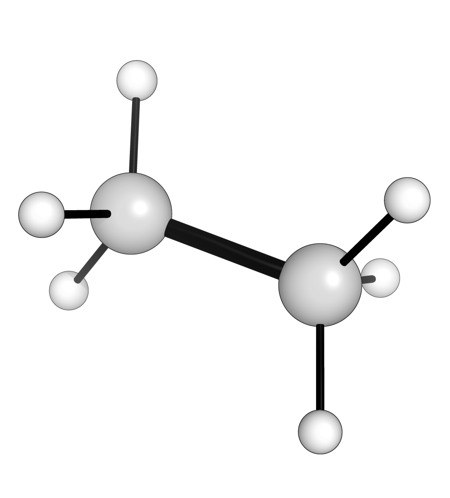

Generate Gaussian Inputs
========================

For these examples we are going to assume that we have a folder named 'sdf_files'
that contains a single file 'ethane.sdf' with a single conformer in .sdf format 
whose gaussian input file we want to generate. As you might have guessed in this 
specific example we will be working with Ethane. 

|mol_3d|

The sdf file contents are as follows: 

.. literalinclude:: ../../chemfiles/ethane.sdf

.. note:: 
   
   The following code will also work for multiple conformers and/or molecules. 

.. note:: 

   aqme supports various formats for providing the geometries of the conformers.
   If we want to use a format to specify the molecule that does not contain 
   3D coordinates we will need to generate them beforehand, please see the 
   :doc:`Conformer Search <../conformer_search>` section.

First we start importing the required modules. 

.. code:: python

   from pathlib import Path
   from aqme.qprep import qprep

Next we list all the files whose gaussian input we want. 

.. code:: python

    sdf_files = [str(filepath) for filepath in Path('sdf_files').glob('*.sdf'))]

Now we proceed to generate the gaussian input files. 

.. code:: python

    qprep(files=sdf_files, 
          qm_input='wb97xd/def2qzvpp scrf=(smd,solvent=acetonitrile)', 
          suffix='wb97xd-basic',
          program='gaussian', 
          mem='16GB', 
          nprocs=8)

With this we have generated a new folder named QCALC that contains the file 
'ethane_conf_1_wb97xd-basic.com' with the following contents:

.. literalinclude:: ../../chemfiles/ethane_basic.com

Enforce Charge and Multiplicity
-------------------------------

If we had wanted to specify the charge and multiplicity we just need to add the 
appropriate keywords. 

.. code:: python

    qprep(files=sdf_files, 
          charge=0, 
          mult=3,
          qm_input='wb97xd/def2qzvpp scrf=(smd,solvent=acetonitrile)', 
          suffix='wb97xd-triplet',
          program='gaussian', 
          mem='16GB', 
          nprocs=8)

Will lead to the creation of the file 'ethane_conf_1_wb97xd-triplet.com' with the
following contents: 

.. literalinclude:: ../../chemfiles/ethane_ch_mult.com

Include the genecp section
--------------------------

If we want to include a genecp with automatic detection of the atoms in the 
molecule we have to add some extra keywords. 

.. code:: python

    qprep(files=sdf_files,
          bs_gen='def2svp',         # Basis set to use in the atoms included in genECP
          bs_nogen='6-31G*',        # Basis set to use in the rest of the atoms
          gen_atoms=['C'],          # Atoms to include as genECP
          qm_input='wb97xd/genecp scrf=(smd,solvent=acetonitrile)', 
          suffix='wb97xd-genecp',
          program='gaussian', 
          mem='16GB', 
          nprocs=8)

Will lead to the creation of the file 'ethane_conf_1_wb97xd-genecp.com' with the
following contents: 

.. literalinclude:: ../../chemfiles/ethane_genecp.com

Include instructions after the geometry section
-----------------------------------------------

Finally if we want to specify some extra instructions after the geometry which 
are required for some commands such as the modredundant optimization option or 
for nbo6 calculations. Here we use the NBO as an example. 

.. code:: python

    qprep(files=sdf_files,
          qm_end='$nbo bndidx $end',    # Final lines after the coordinates section
          qm_input='pop=(nbo6read,savenbos) wb97xd/def2svp', 
          suffix='wb97xd-nbo',
          program='gaussian', 
          mem='16GB', 
          nprocs=8)

Will lead to the creation of the file 'ethane_conf_1_wb97xd-nbo.com' with the
following contents: 

.. literalinclude:: ../../chemfiles/ethane_nbo.com

