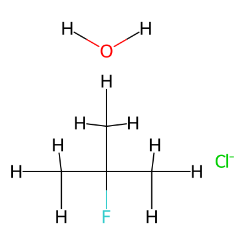
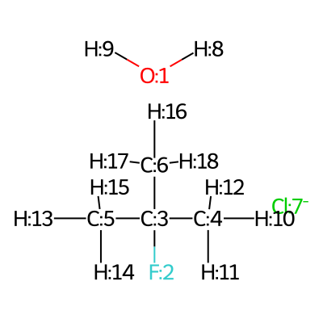

.. |nocov_ts_3D| image:: ../../images/Quinine-3D-balls.png
   :width: 400

TS involving a trimolecular complex generated from SMILES
=========================================================

In the following example we will generate conformers of the SN2 transition state 
involving Water, Cloride ion and 2-Fluoro-2-methylpropane. 

+-----------------------------------------------+
| .. centered:: **SMILES**                      |
+-----------------------------------------------+
| .. centered:: O.FC(C)(C)C.[Cl-]               |
+--------------------------+--------------------+
|  |nocov_ts_chemdraw|     |  |nocov_ts_3D|     |
+--------------------------+--------------------+

In the following example we will: 

1) Use the atom ordering of the provided SMILES to set up the constraints.
2) Do a constrained conformational search (using CREST) to generate various 
   conformers  of the SN2 transition state involving Water, Cloride ion and 
   2-Fluoro-2-methylpropane.

We start by importing the necessary packages: 

.. code:: python

    from rdkit import Chem
    from aqme.csearch import csearch

Now we are going to visualize the atom mapping so taht we know between which 
atoms we are going to impose the constraints. 

.. code:: python

    smi = 'O.FC(C)(C)C.[Cl-]'
    mol = Chem.MolFromSmiles(smi)
    mol = Chem.AddHs(mol)
    for i,atom in enumerate(mol.GetAtoms()):
        atom.SetAtomMapNum(i+3) 
    # mapped SMILES to use in CSEARCH
    smi_new = Chem.MolToSmiles(mol)

If we are in a jupyter notebook we should be able to directly visualize the 
mapping by typing:

.. code:: 

    mol

Otherwise we will need to save the image into a file to visualize it. 

.. code:: 

    Chem.Draw.MolToFile(mol,'mapping.png')

|mapping|

Now that we can visualize the mapping, we can proceed to set up the constraints
in this case we want the C-F and the Cl-C bond distances to be constrained and 
equal to 1.8 angstroms and we want the angle Cl-C-F to be of 180º. 

.. code:: 

    F = 2
    C = 3
    Cl = 7
    constraits_dist = [[F,C,1.8],[C,Cl,1.8]]
    constraits_angle = [[F,C,Cl,180]]

Finally we proceed to the conformer generation using CREST

.. code:: 

    csearch(smi=smi_new,              # mapped SMILES
            name='TS-example',        # name of the output file
            program='crest',          # conformer search program
            cregen=True,              # Include CREGEN post-analysis
            crest_keywords='--nci',   # indicate that it is a non-covalent complex
            constraints_dist=constraits_dist,
            constraints_angle=constraits_angle)

