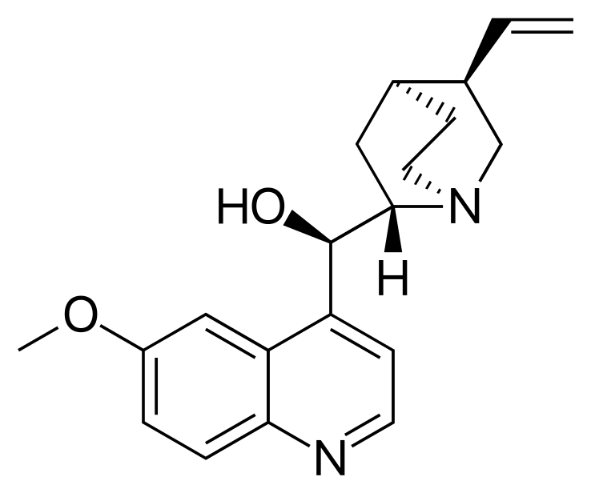
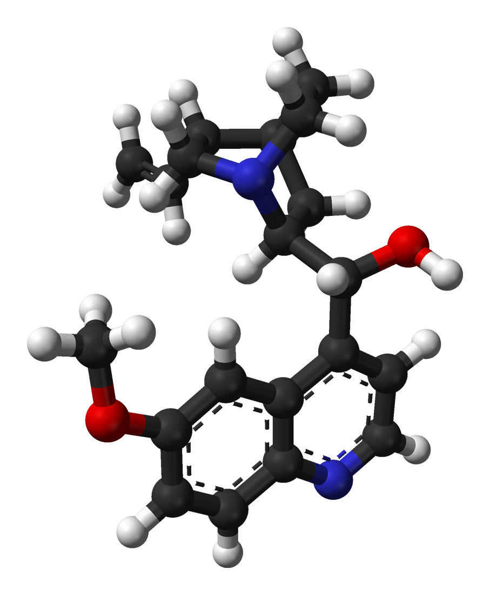

Organic Molecule generated from SMILES
======================================

In the following examples we will be generating conformations of the 
quinine molecule. 

+------------------------------------------------------------------------------+
|                         .. centered:: **SMILES**                             |
+------------------------------------------------------------------------------+
| .. centered:: COC1=CC2=C(C=CN=C2C=C1)[C@H]([C@@H]3C[C@@H]4CCN3C[C@@H]4C=C)O  |
+----------------------------------------+-------------------------------------+
|          |quinine_chemdraw|            |              |quinine_3D|           |
+----------------------------------------+-------------------------------------+

Conformer Generation
--------------------

We start by importing the packages

.. code:: python

    from pathlib import Path
    from aqme.csearch import csearch

Then we define where will the documents be created, in this case we want to 
create a new folder named 'quinine_folder' in the same folder that we are. 

.. code:: python

    w_dir_main = Path.cwd()
    sdf_path = w_dir_main/'quinine_folder'

Finally we proceed to the conformational search using the smiles string of the 
molecule. 

.. code:: python

    smiles = 'COC1=CC2=C(C=CN=C2C=C1)[C@H]([C@@H]3C[C@@H]4CCN3C[C@@H]4C=C)O'
    csearch(destination=sdf_path,
            smi=smiles,
            name='quinine',
            program='rdkit')

Here we are specifying that we want to use rdkit for the conformer generation 
when we specify program='rdkit' and we are specifying the base name of the output 
files to be 'quinine'. 

At this point we will have a new folder already created named 'quinine_folder' 
that contains a file named quinine_rdkit.sdf that contains all the conformers
generated. 

If we wanted to use fullmonte instead to generate the geometries then we just 
need to change the program parameter to 'fullmonte': 

.. code :: python 

    smiles = 'COC1=CC2=C(C=CN=C2C=C1)[C@H]([C@@H]3C[C@@H]4CCN3C[C@@H]4C=C)O'
    csearch(destination=sdf_path,
            smi=smiles,
            name='quinine',
            program='fullmonte')

Minimizing the conformations
----------------------------

Back to our conformers generated using rdkit we might be interested in running 
an energy minization using XTB or ANI. To do so we will need the cmin module. 

.. code:: python 

    from aqme.cmin import cmin

After importing the module we just need to provide the files that we have 
generated. In this case we already know that we have a single file so we can 
directly provide its location to the cmin module. 

.. code:: python

    sdf_cmin_path = w_dir_main/'quinine_ani'
    sdf_files = [str(sdf_path/'quinine_rdkit.sdf'),]
    cmin(destination=sdf_cmin_path,
         files=sdf_files,
         program='ani')

Here 'destination' is the folder where the new optimized geometries will be 
generated, 'files' is a list of files that we want to minimize and 'program'
is specifying that we want to run the minimizations using 'ani'. 

If we do not know the exact name of the file or have several files we can 
get the list of all the files with the following line. 

.. code:: python 

    sdf_files = sdf_path.glob('*.sdf')

Using csv files as input
------------------------

Another way of providing the molecule to the program is by writing it into a csv
file. Lets asume we have in our working directory the file 'ML_test.csv' with the 
following contents: 

::

   code_name,SMILES
   quinine,COC1=CC2=C(C=CN=C2C=C1)[C@H]([C@@H]3C[C@@H]4CCN3C[C@@H]4C=C)O

With this file we can run the same conformer search that we run at the beggining
with the following code: 

.. code:: python 

    import os, glob
    from pathlib import Path
    from aqme.csearch import csearch

    w_dir_main = Path.cwd()
    sdf_path = w_dir_main/'quinine_folder'
    csv_input = w_dir_main/'ML_test.csv'

    csearch(destination=sdf_path,
            program='rdkit',
            input=csv_input)

