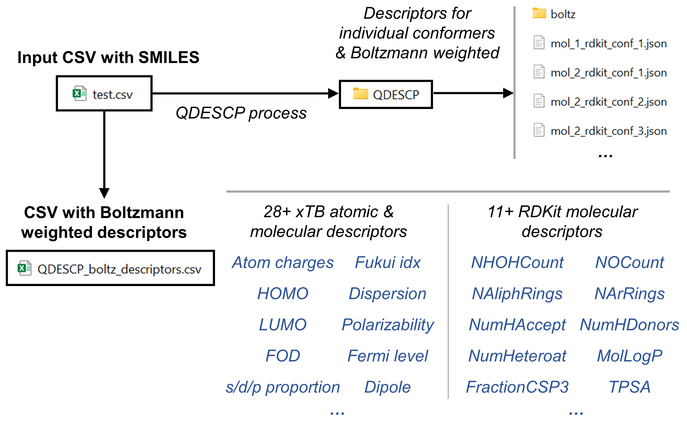

=====================
Descriptor Generation
=====================

In this example we are going to generate a collection of xtb-derived chemical 
descriptors as well as a collection of RDKit-derived descriptors. We 
are going to store them in .json format for each molecule. And we are going to 
create a csv file with the boltzmann averaged values of the descriptors that we 
have calculated per each molecule. The following scheme summarizes the contents 
of this example. 

.. centered:: |QDESCP_scheme|

We are starting from a 'test.csv' file containing the SMILES of the molecules whose 
chemical descriptors we are going to calculate:

.. highlight:: none

::

    SMILES,code_name
    CN1[N]C=NN(C)C1=O,mol_0
    CC1(C)N([O])[CH]N([O])C1(C)C,mol_1
    CC1(C)CCC(C)(C)N1[O],mol_2
    CC1(C)C=CC(C)(C)N1[O],mol_3
    CC1(C)CCCC(C)(C)[N+]1[O-],mol_4
    CC(C)(C)N([O])c1ccccc1,mol_5
    CC(C)(C)c1cc([CH]c2cc(C(C)(C)C)c([O])c(C(C)(C)C)c2)cc(C(C)(C)C)c1[O],mol_6
    c1ccc([C](c2ccccc2)c2ccccc2)cc1,mol_7
    Clc1c(Cl)c(Cl)c([C](c2c(Cl)c(Cl)c(Cl)c(Cl)c2Cl)c2c(Cl)c(Cl)c(Cl)c(Cl)c2Cl)c(Cl)c1Cl,mol_8
    [CH]1C=c2ccccc2=C2C1=c1ccc3ccccc3c1=C2c1c2ccccc2cc2ccccc12,mol_9

.. highlight:: default

In this case we are going to start by generating some conformers of these 
molecules using rdkit (for more details on the conformer generation please 
check the :doc:`Conformer Search <conformer_search>` section).

.. code:: python 

   from aqme.csearch import csearch 

   csearch(input='test.csv',
           name='test',
           program='rdkit')

Next we proceed to generate the descriptors which is fully automated by the 
QDESCP module. 

.. code:: python

   from pathlib import Path
   from aqme.qdescp import qdescp

   conformer_files = [str(filepath) for filepath in Path('CSEARCH').glob('*.sdf')]
   
   qdescp(files=conformer_files,boltz=True)

