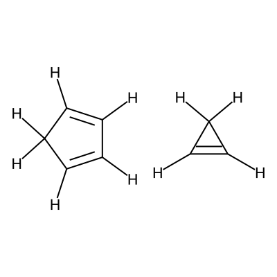
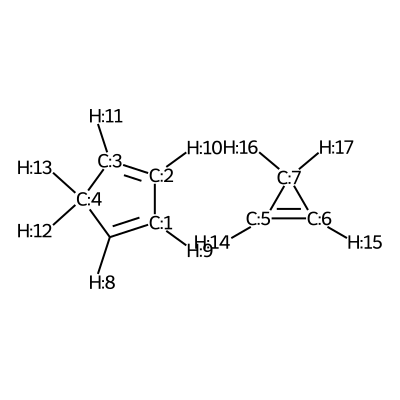
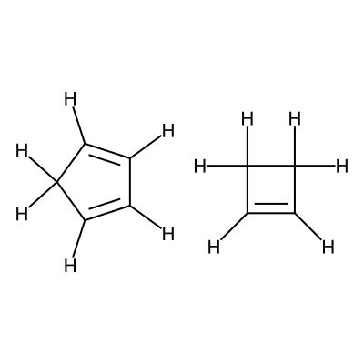
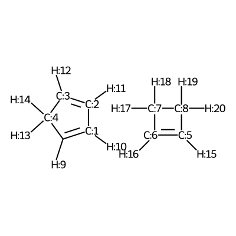
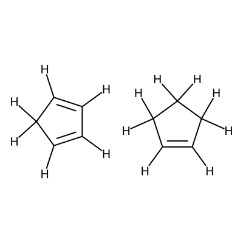
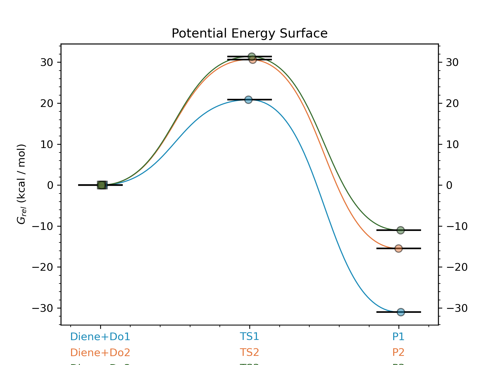

.. |pair_3_map| image:: ../../images/diels_alder_3_map.png
   :width: 300

Diels-Alder reactions
=====================

Along the steps of this example workflow we will show how to: 

i)   Generate different conformers of molecules and noncovalent complexes using CREST
ii)  Generate the inputs for Gaussian geometry optimizations and frequency calcs
     (B3LYP/def2TZVP)
iii) Fixing errors and imaginary frequencies of the output LOG files
iv)  Generate ORCA inputs for single-point energy corrections (SPC) using
     DLPNO-CCSD(T)/def2TZVPP
v)   Calculate the Boltzmann weighted thermochemistry using with GoodVibes at
     298.15 K

Specifially in this workflow we will calculate the free energy profile 
for the Diels-Alder reaction for three pairs of reactants shown below:

+--------------------------------+---------------------------------+----------------------------------+
| .. centered:: **Reactants 1**  | .. centered:: **Reactants 2**   | .. centered:: **Reactants 3**    |
+--------------------------------+---------------------------------+----------------------------------+
| .. centered:: C1=CC=CC1.C1=CC1 | .. centered:: C1=CC=CC1.C1=CCC1 | .. centered:: C1=CC=CC1.C1=CCCC1 |
+--------------------------------+---------------------------------+----------------------------------+
| .. centered::  |pair_1|        | .. centered::  |pair_2|         | .. centered::  |pair_3|          |
+--------------------------------+---------------------------------+----------------------------------+

.. note::

   A jupyter notebook containing all the steps shown in this example can be found 
   in the AQME repository in `Github  <https://github.com/jvalegre/aqme>`__ or in 
   `Figshare <https://figshare.com/articles/dataset/AQME_paper_examples/20043665/11>`__

.. contents:: Steps
   :local:

Step 1: Importing AQME and other python modules
-----------------------------------------------

.. code:: python

    import os, glob, subprocess
    import shutil
    from pathlib import Path
    from aqme.csearch import csearch
    from aqme.qprep import qprep
    from aqme.qcorr import qcorr
    from rdkit import Chem
    import pandas as pd

Step 2: Determining distance and angle constraints for TSs
----------------------------------------------------------

We visualize the first pair of reactants to be able to set up the constraints. 

.. code:: python

    smi1 = 'C1=CC=CC1.C1=CC1'
    mol1 = Chem.MolFromSmiles(smi1)
    mol1 = Chem.AddHs(mol1)
    for i,atom in enumerate(mol1.GetAtoms()):
        atom.SetAtomMapNum(i)
    smi_new1 = Chem.MolToSmiles(mol1)
    print('The new mapped smiles for checking numbers used in constraints is:', smi_new1)
    
    mol1

.. centered::  |pair_1_map|

According to the image we will add the following constraints to the CSV, in the 
constraints_dist column we will include :code:`[[3,5,2.35],[0,6,2.35]]`

.. note:: 
   
   For this step we are assuming that the code is being executed in a 
   jupyter notebook. If it is being used through the python console, the
   following line allows to save the image with the mapping: 

   .. code:: python 
       
       from rdkit.Chem import Draw
       Draw.MolToFile(mol,'mapping_image.png')

We visualize the second pair of reactants to be able to set up the constraints. 

.. code:: python

    smi1 = 'C1=CC=CC1.C1=CCC1'
    mol1 = Chem.MolFromSmiles(smi1)
    mol1 = Chem.AddHs(mol1)
    for i,atom in enumerate(mol1.GetAtoms()):
        atom.SetAtomMapNum(i)
    smi_new1 = Chem.MolToSmiles(mol1)
    print('The new mapped smiles for checking numbers used in constraints is:', smi_new1)
    
    mol1

.. centered::  |pair_2_map|

According to the image we will add the following constraints to the CSV, in the 
constraints_dist column we will include :code:`[[3,6,2.35],[0,5,2.35]]`

.. warning:: 

   Although the atoms 5 and 6 are equivalent, we have observed that if we use 
   the same ordering as in the previous reaction for the constraints the TS 
   won't be found (i.e. with :code:`[[3,5,2.35],[0,6,2.35]]`) whereas when we 
   use the constraints as shown in the example the TS is found. 

We visualize the third pair of reactants to be able to set up the constraints. 

.. code:: python

    smi1 = 'C1=CC=CC1.C1=CCCC1'
    mol1 = Chem.MolFromSmiles(smi1)
    mol1 = Chem.AddHs(mol1)
    for i,atom in enumerate(mol1.GetAtoms()):
        atom.SetAtomMapNum(i)
    smi_new1 = Chem.MolToSmiles(mol1)
    print('The new mapped smiles for checking numbers used in constraints is:', smi_new1)
    
    mol1

.. centered:: |pair_3_map|

According to the image we will add the following constraints to the CSV, in the 
constraints_dist column we will include :code:`[[3,5,2.35],[0,6,2.35]]`

Step 3: CSEARCH conformational sampling
---------------------------------------

With the previous step we can now create a csv file containing all the molecules
and noncovalent complexes to calculate, which will have the following contents: 

.. highlight:: none

.. literalinclude:: ../../chemfiles/end_to_end_2_inp.csv

.. highlight:: default

Now we can proceed to the conformer generation:

.. code:: python

    # read the CSV file with SMILES strings and constraints for TSs (from Step 2)
    data = pd.read_csv('example2.csv')
    
    csearch(input='example2.csv',
            program='crest',
            nprocs=12,
            cregen=True,
            cregen_keywords='--ethr 0.1 --rthr 0.2 --bthr 0.3 --ewin 1')

Step 4: Creating Gaussian input files for optimization and frequency with QPREP
-------------------------------------------------------------------------------

.. code:: python

    program = 'gaussian'
    mem='32GB'
    nprocs=16
    
    sdf_TS_files = glob.glob('CSEARCH/TS*crest.sdf')

    # COM files for the TSs
    qm_input_TS = 'B3LYP/def2tzvp opt=(ts,calcfc,noeigen,maxstep=5) freq=noraman'
    qprep(files=sdf_TS_files,
          program=program,
          qm_input=qm_input_TS,
          mem=mem,
          nprocs=nprocs)
    
    sdf_INT_files = glob.glob('CSEARCH/D*.sdf') + glob.glob('CSEARCH/P*.sdf')
    
    # COM files for intermediates, reagents and products
    qm_input_INT = 'B3LYP/def2tzvp opt freq=noraman'
    
    qprep(files=sdf_INT_files,
          program=program,
          qm_input=qm_input_INT,
          mem=mem,
          nprocs=nprocs)

Step 5: Running Gaussian inputs for optimization and frequency calcs externally
-------------------------------------------------------------------------------

Now that we have generated our gaussian input files (in the QCALC location 
of Step 3) we need to run the gaussian calculations. If you do not know how to 
run the Gaussian calculations in your HPC please refer to your HPC manager. 

As an example, for a single calculation in Gaussian 16 through the terminal we 
would run the following command on a Linux-based system: 

.. code:: shell

    g16 myfile.com

Step 6: QCORR analysis
----------------------

.. code:: python

    qcorr(files='QCALC/*.log',
          freq_conv='opt=(calcfc,maxstep=5)',
          mem=mem,
          nprocs=nprocs)

Step 7: Resubmission of unsuccessful calculations (if any) with suggestions from AQME
-------------------------------------------------------------------------------------

Now we need to run the generated COM files (in fixed_QM_inputs) with Gaussian 
like we did in Step 6

Step 8: Creating DLPNO input files for ORCA single-point energy calculations
----------------------------------------------------------------------------

.. code:: python

    program = 'orca'
    mem='16GB'
    nprocs=8
    
    qm_files = os.getcwd()+'/QCALC/success/*.log' # LOG files from Steps 6 and 8
    destination =  os.getcwd()+'/SP' # folder where the ORCA output files are generated
    
    # keyword lines for ORCA inputs
    qm_input = r'''
    DLPNO-CCSD(T) def2-tzvpp def2-tzvpp/C
    %scf maxiter 500
    end
    % mdci
    Density None
    end
    % elprop
    Dipole False
    end'''.lstrip()
    
    qprep(destination=destination,
          files=qm_files,
          program=program,
          qm_input=qm_input,
          mem=mem,
          nprocs=nprocs,
          suffix='DLPNO')

Step 9: Running ORCA inputs for single point energy calcs externally
--------------------------------------------------------------------

Now we need to run the generated inp files (in sp_path) with ORCA 
(similarly to how we did in Step 4)

Step 10: Calculating PES with goodvibes
---------------------------------------

for this step we will need to have a yaml file to use as input for goodvibes. 
The contents of the yaml file are: 

.. code:: yaml
   
   --- # PES
   # Double S addition
      Reaction1: [Diene+Do1, TS1, P1] 
      Reaction2: [Diene+Do2, TS2, P2] 
      Reaction3: [Diene+Do3, TS3, P3] 
      
   
   --- # SPECIES
       Diene     : Diene*
      Do1     : Do1*
      TS1     : TS1*
      P1    : P1*
      Do2     : Do2*
      TS2     : TS2*
      P2    : P2*
      Do3    : Do3*
      TS3     : TS3*
      P3   : P3*
     
   
   --- # FORMAT
      dec : 1
      units: kcal/mol
      dpi : 300
      color : #1b8bb9,#e5783d,#386e30

With this file we can now generate the profile.

.. code:: python

    # folder where the OUT files from Step 10 are generated
    orca_files = os.getcwd()+'/SP/*.out' 
    
    # copy all the Gaussian LOG files and the ORCA OUT files into a new folder 
    # called GoodVibes_analysis (necessary to apply SPC corrections)

    opt_files = glob.glob(qm_files)
    spc_files = glob.glob(orca_files)
    all_files = opt_files + spc_files
    
    w_dir_main  = Path(os.getcwd())
    GV_folder = w_dir_main.joinpath('GoodVibes_analysis')
    GV_folder.mkdir(exist_ok=True, parents=True)
    
    for file in all_files:
        shutil.copy(file, GV_folder)
    
    # run GoodVibes
    os.chdir(GV_folder)
    command = 'python -m goodvibes --xyz --pes ../pes.yaml --graph ../pes.yaml -c 1 --spc DLPNO *.log'
    subprocess.run(command.split())
    os.chdir(w_dir_main)

.. centered:: |profile|