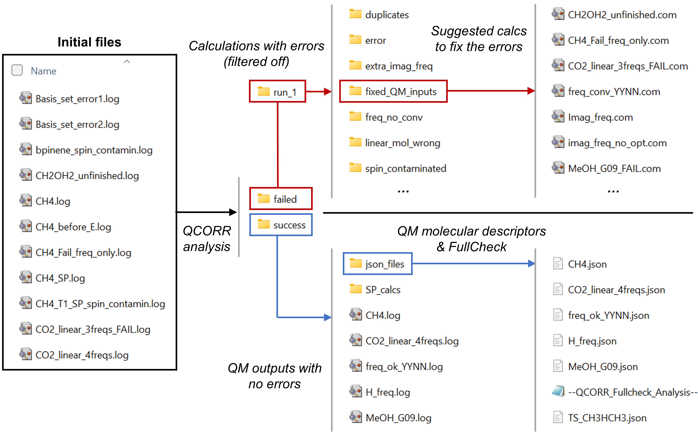

QCORR (analysis and correction of QM output files)
==================================================

Overview
--------

The QCORR module focuses on the analysis and correction of the output files of 
QM calculations. Here we refer to correction as: 

*  Generate new inputs for calculations that have an error termination 
*  Generate new inputs for calculations containing a wrong number of imaginary frequencies
*  Generate new inputs for calculations with other issues (i.e., SCF convergence issues, no stationary points in FREQ calculations, etc.)
*  Remove duplicated calculations
*  Remove calculations that have isomerized (if the initial input files are provided)
*  Ensure that all provided files have the same level of theory, grid size, 
   program, version, etc.

The following scheme shows how QCORR works and how it sorts the calculations.

.. centered:: |QCORR_scheme|
