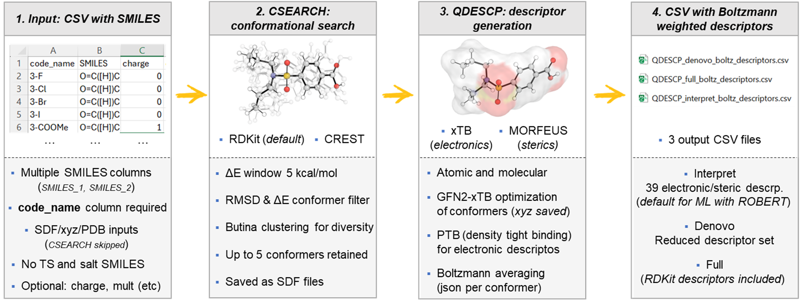

QDESCP (descriptor generation)
==============================

Overview
--------

The QDESCP module implemented in AQME enables the automated calculation of molecular 
and atom-centered descriptors from either SMILES strings or three-dimensional structures. 
In the current implementation, descriptor generation is performed through MORFEUS, which 
acts as a unified interface to obtain electronic and steric descriptors.

Electronic descriptors are extracted from xTB calculations, preferentially using the PTB 
method when available and GFN2-xTB for descriptors not supported at the PTB level. In parallel, 
steric descriptors are computed directly from the GFN2-xTB-optimized geometries.

The overall workflow is summarized in this figure:

.. centered:: |QDESCP_scheme|

Workflow Description
--------------------

**1. Conformational search (if starting from SMILES)**

When the starting point is a CSV file containing SMILES strings, conformational sampling is first 
performed using the CSEARCH workflow in AQME, typically employing RDKit (default) and optionally CREST.

The generated conformers are filtered using:

- An energy window (ΔE ≤ 5 kcal mol⁻¹)
- RMSD-based filtering
- Butina clustering

This process retains a structurally diverse subset of low-energy conformers (up to five conformers per 
molecule), which are stored as SDF files.

If three-dimensional structures are provided directly (e.g., XYZ or SDF files), the conformational 
search step is skipped, and the structures are used directly for descriptor generation.

**2. Geometry optimization with GFN2-xTB**

The resulting conformers are subsequently optimized at the GFN2-xTB level. This option can be skipped using :code:`xtb_opt=False` (or :code:`--xtb_opt False` in command line).

**3. Descriptor generation**

Through MORFEUS, both molecular and atom-centered descriptors are obtained from 
the optimized geometries. Descriptors are first computed for each conformer and subsequently 
Boltzmann-weighted to obtain a single descriptor set per molecule.

Applicability
-------------

The workflow is applicable to both organic and organometallic systems, provided that the underlying 
xTB calculations converge reliably.

.. warning::

   As with other semiempirical approaches, the quality of the resulting descriptors depends on the robustness of the electronic structure calculations. Systems involving:

    - Multireference character
    - Excited states (i.e., S₁, S₂, T₁...)
    - Aggregates or noncovalent complexes

   should be interpreted with caution.

Output
------

The workflow produces CSV files containing Boltzmann-weighted descriptors corresponding to 
different descriptor subsets:

- interpret *(default)*
- denovo *(reduced set)*
- full *(extended set including RDKit features)*

Descriptor Table
----------------

.. note:: 
    All citations for the descriptors and formulae can be found in our publication describing the descriptor‑generation workflow.

The final descriptor set combines 21 molecular descriptors and 18 atomic descriptors, including:

* xTB-based electronic descriptors *(PTB method when available, if not GFN2-xTB)*
* MORFEUS steric descriptors

.. list-table::
   :widths: 15 20 15 25 10 15
   :header-rows: 1

   * - Type
     - Full name
     - Descriptor
     - Definition / equation
     - Units
     - Method

   * - Molecular
     - Highest occupied molecular orbital energy
     - HOMO
     - :math:`E_{\mathrm{HOMO}}`
     - eV
     - PTB

   * - Molecular
     - Lowest unoccupied molecular orbital energy
     - LUMO
     - :math:`E_{\mathrm{LUMO}}`
     - eV
     - PTB

   * - Molecular
     - HOMO–LUMO gap
     - HOMO–LUMO gap
     - :math:`E_{\text{gap}} = E_{\mathrm{LUMO}} - E_{\mathrm{HOMO}}`
     - eV
     - PTB

   * - Molecular
     - Ionization potential
     - IP
     - :math:`\mathrm{IP} = E(N-1) - E(N)`
     - eV
     - GFN2

   * - Molecular
     - Electron affinity
     - EA
     - :math:`\mathrm{EA} = E(N) - E(N+1)`
     - eV
     - GFN2

   * - Molecular
     - Molecular dipole moment magnitude
     - Dipole module
     - :math:`\text{-}`
     - debye
     - PTB

   * - Molecular
     - Solvent-accessible surface area
     - SASA
     - :math:`\mathrm{SASA} = \sum_i A_i`
     - Ų
     - MORFEUS

   * - Molecular
     - Dispersion surface area
     - Dispersion area
     - :math:`\text{-}`
     - Ų
     - MORFEUS

   * - Molecular
     - Dispersion volume
     - Dispersion volume
     - :math:`\text{-}`
     - ų
     - MORFEUS

   * - Molecular
     - Solvation free energy in water
     - G solv. in H₂O
     - :math:`\Delta G_{\text{solv}}`
     - kcal/mol
     - GFN2

   * - Molecular
     - Hydrogen-bond contribution to solvation
     - G of H-bonds H₂O
     - :math:`\Delta G_{\text{HB}}`
     - kcal/mol
     - GFN2

   * - Molecular
     - Fermi level
     - Fermi-level
     - :math:`E_F = \dfrac{E_{\mathrm{HOMO}} + E_{\mathrm{LUMO}}}{2}`
     - eV
     - GFN2

   * - Molecular
     - Molecular polarizability
     - Polarizability
     - :math:`\text{-}`
     - a₀³
     - GFN2

   * - Molecular
     - Chemical hardness
     - Hardness
     - :math:`\eta = \mathrm{IP} - \mathrm{EA}`
     - eV
     - GFN2

   * - Molecular
     - Chemical softness
     - Softness
     - :math:`S = \dfrac{1}{\eta}`
     - eV⁻¹
     - GFN2

   * - Molecular
     - Chemical potential
     - Chem. potential
     - :math:`\mu = -\dfrac{\mathrm{IP} + \mathrm{EA}}{2}`
     - eV
     - GFN2

   * - Molecular
     - Electrophilicity index
     - Electrophilicity
     - :math:`\omega = \dfrac{(\mathrm{IP}+\mathrm{EA})^2}{8(\mathrm{IP}-\mathrm{EA})} = \dfrac{\mu^2}{2\eta}`
     - eV
     - GFN2

   * - Molecular
     - Electrofugality
     - Electrofugality
     - :math:`\nu_{\text{electrofugality}} = \dfrac{(3\mathrm{IP}-\mathrm{EA})^2}{8(\mathrm{IP}-\mathrm{EA})} = \mathrm{IP} + \omega`
     - eV
     - GFN2

   * - Molecular
     - Nucleofugality
     - Nucleofugality
     - :math:`\nu_{\text{nucleofugality}} = \dfrac{(\mathrm{IP}-3\mathrm{EA})^2}{8(\mathrm{IP}-\mathrm{EA})} = -\mathrm{EA} + \omega`
     - eV
     - GFN2

   * - Molecular
     - Fractional occupation density
     - Total FOD
     - :math:`\text{-}`
     - e
     - GFN2

   * - Molecular
     - Singlet–triplet energy gap
     - S₀–T₁ gap
     - :math:`\Delta E_{S0\text{-}T1} = E_{T1} - E_{S0}`
     - kcal/mol
     - GFN2

   * - Atomic
     - Atomic hydrogen-bond contribution to solvation
     - H-bond H₂O
     - :math:`\Delta G_{\text{HB},i}`
     - kcal/mol
     - GFN2

   * - Atomic
     - Mulliken partial charge
     - Partial charge
     - :math:`q_i`
     - e
     - PTB

   * - Atomic
     - Atomic dipole moment magnitude
     - Dipole moment
     - :math:`\text{-}`
     - debye
     - PTB

   * - Atomic
     - Atom solvent accessible surface area
     - Atom SASA
     - :math:`A_i`
     - Ų
     - MORFEUS

   * - Atomic
     - Atomic dispersion descriptor
     - Atom dispersion
     - :math:`\text{-}`
     - Ų
     - MORFEUS

   * - Atomic
     - Percent buried volume
     - Buried volume
     - :math:`\text{-}`
     - %
     - MORFEUS

   * - Atomic
     - Pyramidalization parameter
     - Pyramidalization
     - :math:`P = \sin(\theta)·\cos(\alpha)`
     - :math:`\text{-}`
     - MORFEUS

   * - Atomic
     - Pyramidalization angle
     - Pyramidaliz. volume
     - :math:`P = \sqrt{360^\circ - \sum_i \theta_i}`
     - °
     - MORFEUS

   * - Atomic
     - Fukui nucleophilic index
     - Fukui+
     - :math:`f^+ = q_N - q_{N+1}`
     - :math:`\text{-}`
     - GFN2

   * - Atomic
     - Fukui electrophilic index
     - Fukui−
     - :math:`f^- = q_{N-1} - q_N`
     - :math:`\text{-}`
     - GFN2

   * - Atomic
     - Radical Fukui index
     - Fukui_rad
     - :math:`f_{\mathrm{rad}} = \dfrac{q_{N-1} - q_{N+1}}{2}`
     - :math:`\text{-}`
     - GFN2

   * - Atomic
     - Dual Fukui descriptor
     - Fukui dual
     - :math:`f^{(2)} = f^+ - f^-`
     - :math:`\text{-}`
     - GFN2

   * - Atomic
     - Local electrophilicity
     - Electrophil.
     - :math:`l_\omega = -\dfrac{\mu}{\eta} f + \tfrac{1}{2}\dfrac{\mu}{\eta^2} f^{(2)}`
     - :math:`\text{-}`
     - GFN2

   * - Atomic
     - Normalized electrophilicity
     - Normaliz. electrophil.
     - :math:`\omega_i = \omega\ · f_i^+`
     - eV
     - GFN2

   * - Atomic
     - Normalized nucleophilicity
     - Normaliz. nucleophil.
     - :math:`N_i = -\mathrm{IP}\ · f_i^-`
     - eV
     - GFN2

   * - Atomic
     - Atomic polarizability
     - Atom Polarizability
     - :math:`\text{-}`
     - a₀³
     - GFN2

   * - Atomic
     - Atomic FOD population
     - Atom FOD
     - :math:`\text{-}`
     - e
     - GFN2

   * - Atomic
     - Coordination number
     - Coord. numbers
     - :math:`\text{-}`
     - :math:`\text{-}`
     - GFN2